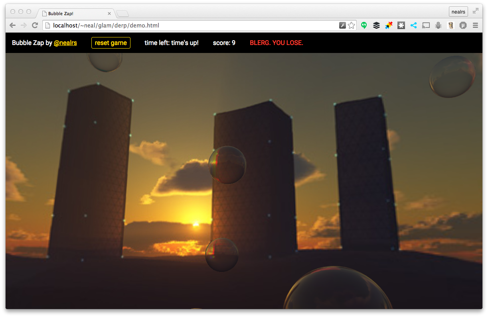

## Bubble Zap

Bubble Zap is the first game I've ever built. Basically, you have 60 seconds to pop 50 bubbles in a 3d space. It's harder than it looks, _if you don't cheat & zoom out_.

This game is an adapted version of the [bubble pop! demo](http://tparisi.github.io/glam/demos/bubblepop.html) from [Tony Parisi's glam (GL And Markup) project](https://github.com/tparisi/glam). All I've done is re-skin it and added some game logic, but I'm hella proud of it.

**FYI** I've really only tried this on Chrome and it's bit of a resource hog. I did manage to score a 47 on my iPad though, so it's possible.

I created this game to learn more about glam for Issue 77 of [Git@Me](http://gitat.me).

**Credits:**

- [Tony Parisi & Glam](https://github.com/tparisi/glam)
- [Red Sorceress for the skybox](http://www.redsorceress.com/skybox.html)
- [Soundbible for pop sound](http://soundbible.com/2067-Blop.html)
- [Stack Overflow for the game timer logic](http://stackoverflow.com/questions/9989285/javascript-countdown-timer-and-display-text)
